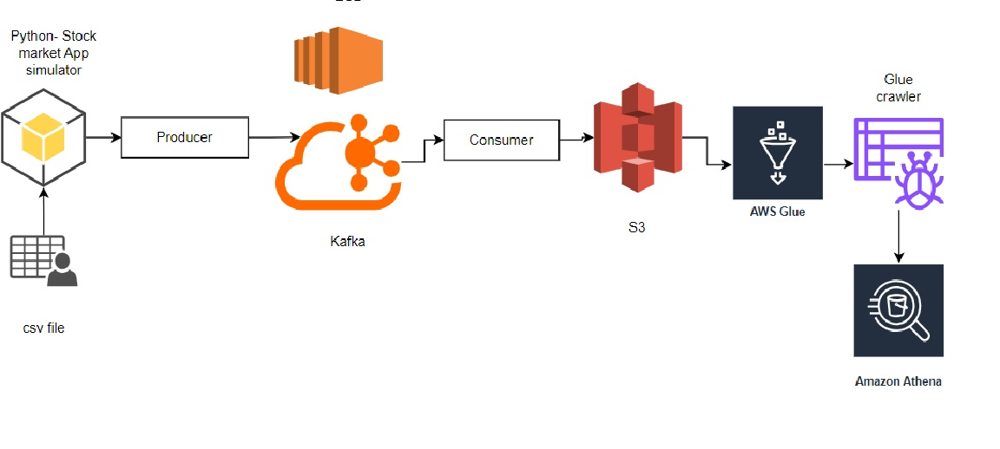

# Kafka_Stock_Analysis-Data_Pipeline

## Overview:
The goal of this project is to build a data pipeline for real-time stock market data analysis using Kafka. Created an end-to-end data pipeline. This includes generating real-time data from a csv file using Python to simulate a stock market app providing real-time data.  The producer code produces real-time data and the consumer consumes the data and writes it into Amazon S3. Here Kafka runs on an EC2 machine where the producer produces data for a topic and the consumer consumes the data.

## Services used:
1. Ec2
2. Amazon S3
3. Kafka
4. AWS Glue (Glue Catalog)
5. Amazon Athena
6. SQL

## Dataset:
The data used in this project is Stock_Market_Data_Realtime-Simulation.csv

## Architecture:

